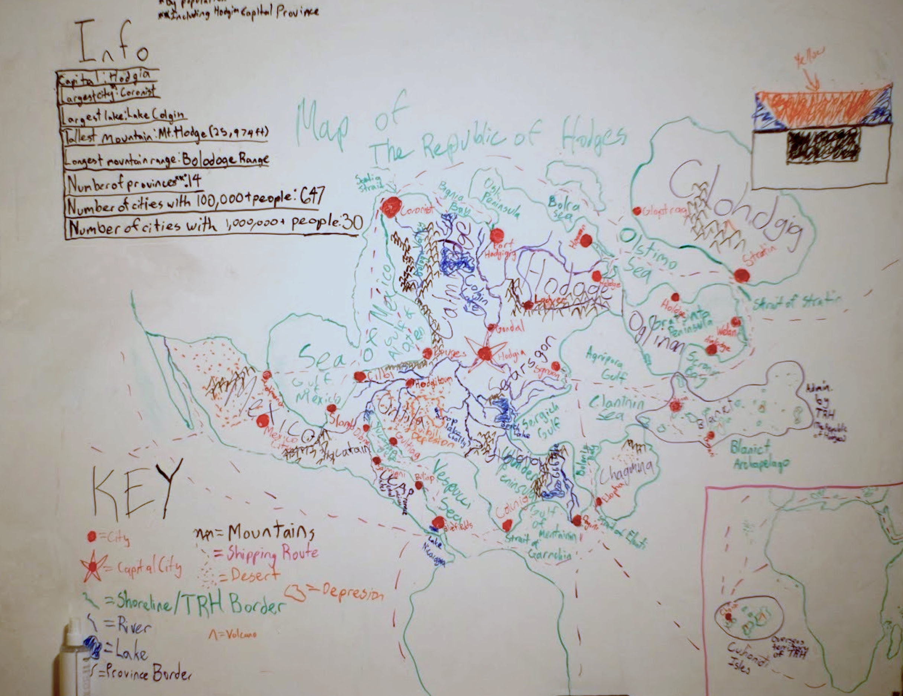
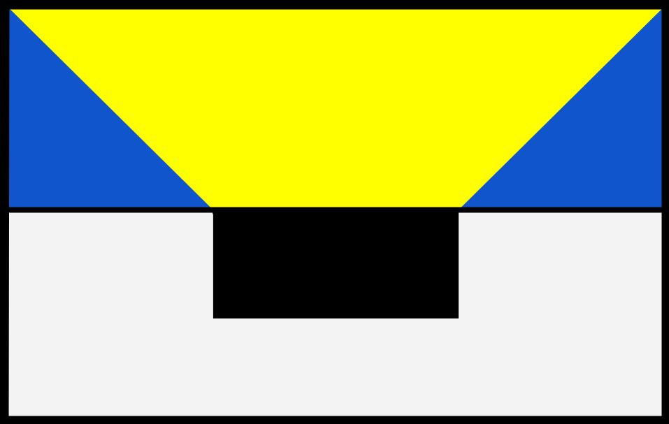
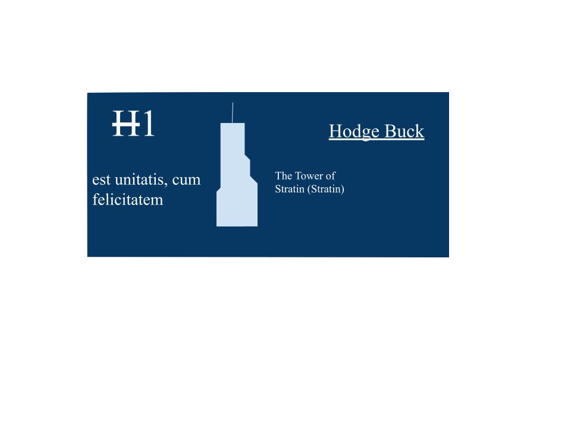
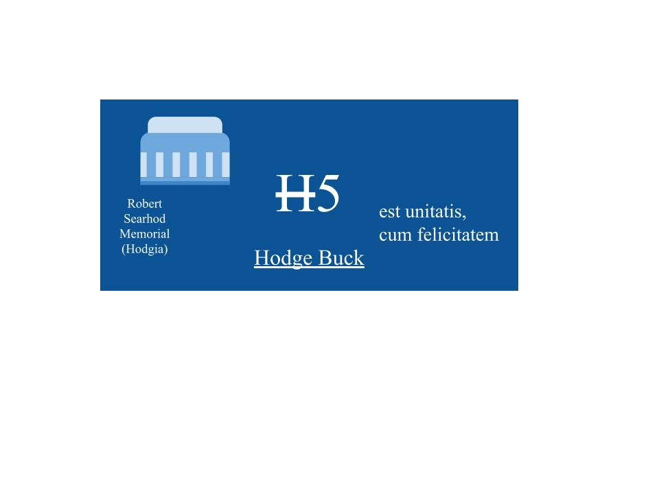

# The HODGE Legacy
**The Republic of Hodges (TRH)** began as an expansive world-building project created by me and a group of friends in the 5th grade. What started as a childhood imagination exercise evolved into a sophisticated "imaginary state" complete with its own **Constitution**, complex geopolitical **alliances**, a dedicated **press corps**, and even a recorded **global war (Hodge War III)**. 

The project was originally documented through a series of slide decks and a dedicated website. Now that I'm in high school, the project is entering a new era. The goal is to leverage **AI agents** (such as OpenClaw) to continue the legacy of Hodginian journalism, maintaining the unique tone, recurring characters (like the immortal but often hospitalized Bob Zwick), and surreal current events that defined the original sources.

***

## Republic of Hodges (TRH)

The **Republic of Hodges** is a sovereign nation characterized by its massive landmass, diverse population, and leadership of the global **Hodge Alliance**. It is currently ranked as the **2nd largest country** in the world by size and the **3rd most populous**.

| **The Republic of Hodges** | |
| :--- | :--- |
| **Motto** | "With unity comes prosperity" |
| **Capital** | Hodgia |
| **Official Website** | [Official Site](https://dylanzijian.wixsite.com/republicofhodges) |
| **National Hero** | Hodge McFrodge |
| **Currency** | Hodge Buck ( ~~H~~ ) |
| **Population** | 678,379,000 |
| **Area** | 4,947,192 sq miles |

---

### **Map**
Map of the Republic of Hodges:

---

### **National Symbols**
*   **Flag:** The national flag features a yellow and blue geometric design on top, with a black rectangular center set against a white base.

    

*   **Currency:** The **Hodge Buck** ( ~~H~~ ). The **H1** note features the **Tower of Stratin**, and the **H5** note depicts the **Robert Searhod Memorial** in Hodgia. Both carry the Latin motto: *est unitatis, cum felicitatem*.

    

    

---

### **History and Conflict**
The Republic’s history is marked by significant geopolitical shifts and military oddities:
*   **Hodge War III:** A global conflict involving four major power blocs. A treaty to end the war was reportedly signed in 2020, though internal tensions remain.
*   **The Singapore Revolution:** A massive uprising of 52,000 people led by **General Unkatri Blopititomipti**. The revolution is famous for a logistical error where the revolutionaries accidentally ordered **fish tanks and ACNE cures** instead of military tanks and ammunition.
*   **Incan Empire Investigation:** Recent scholarly research by Wo ChiFan discovered that the Incan Empire, located on **Ellesmere Island**, possesses advanced **6th-generation fighter jets** (H-CB1 and H-LS(B)1), dispelling myths that they were "Hodge-ignorant barbarians".

---

### **Government and Law**
The nation is governed by the **Constitution of the Republic of Hodges**, a 21-article document establishing a land of freedom and prosperity.
*   **Suffrage:** Citizens can vote at **age 16**.
*   **Citizenship:** Requires owning and **living in a "Hodge"** and passing a government examination.
*   **Declaration of War:** Requires an **80% majority vote** from the population, though the Prime Minister holds veto power.
*   **Environmental Policy:** Companies are subject to a **carbon tax** of ~~H~~ 40 per tonne of CO2 and a ban on one-use plastics.

---

### **Foreign Relations**
The Republic is the headquarters of the **Hodge Alliance**, the world’s most powerful coalition.
1.  **Hodge Alliance:** Includes the USA, China, the Persian Empire, and the **Republic of Penguins**.
2.  **BA HA FRA:** The primary opposition, headquartered in Moscow, Soviet Union.
3.  **Very Confused Alliance:** A sub-division of which is the **Typo Alliance**, led by **Grammarly McFrodge**.

---

### **Culture and Society**
*   **The Hodgeifying World Cup:** A premier sporting event held in **Stratin’s main stadium**. Top competitors include Hodge McFrodge and John Cena (who famously once ate avocado-flavored toilet paper).
*   **Apore Festivals:** Monthly celebrations where citizens throw "Apores." These have been plagued by manufacturing strikes at the **Apore Making Company**, leading to a crisis where machines produced misspelled "REAPO" and "GY^%G6L~" apores.
*   **Public Health:** The nation frequently deals with the **Funderburg Allergy**, which often prevents star athlete **Bob Zwick** from competing.

---

### **Official Newspaper Archives**
These links provide the most comprehensive historical records of the Republic:
*   [**The Hodgia Times V1**](https://docs.google.com/document/d/1d9kAYp-7WvUx7pvj1K-p7PKHv4cAe6Jc/edit?usp=sharing&ouid=105932468790022068736&rtpof=true&sd=true) – *The Singapore Revolution and the Explosive Lime Ice Cream Riots.*
*   [**The Hodgia Times V3**](https://docs.google.com/document/d/1NdWS9x_pI0Jle-daKUSkB7xwit1Gd7GD/edit?usp=drive_link&ouid=105932468790022068736&rtpof=true&sd=true) – *The REAPO Manufacturing Strike and 15 News Facts.*
*   [**The Hodgia Times V4**](https://docs.google.com/document/d/1bBdn4q8_uTIqgz0gFchHd8S9EPJc-1ww/edit?usp=drive_link&ouid=105932468790022068736&rtpof=true&sd=true) – *Incan Fighter Jet Investigation and the National Hodginian Awards.*
*   [**The Daily Hodge**](https://docs.google.com/document/d/1uk9f2vvhXKMMPqLG_yj-lICa9EMLIRSu/edit?usp=drive_link&ouid=105932468790022068736&rtpof=true&sd=true) – *Sports updates and the ongoing health saga of Bob Zwick.*

***

Would you like me to draft the first "AI-generated" newspaper issue for this new era, perhaps focusing on the latest updates from the Incan Empire or the aftermath of the most recent Apore Festival?
